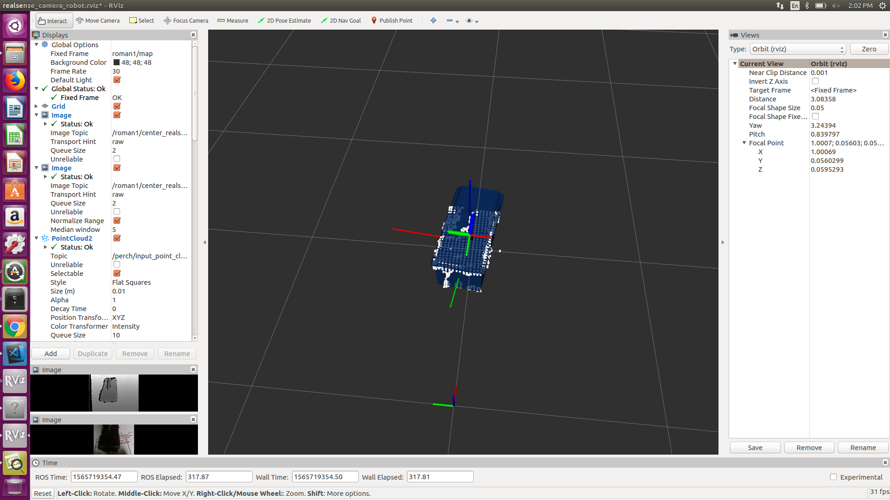

# Deliberative Perception for Multi-Object Pose Estimation

Overview
--------
This library provides implementations for single and multi-object instance localization from RGB-D sensor (MS Kinect, ASUS Xtion etc.) data. These are based on the <a href="http://www.cs.cmu.edu/~venkatrn/papers/icra16a.pdf">PERCH (Perception via Search)</a> and <a href="http://www.cs.cmu.edu/~venkatrn/papers/rss16.pdf">D2P (Discriminatively-guided Deliberative Perception)</a> algorithms.

Features
------------
* Detect single objects in 3D space (in a tabletop setting) in under 10s
* No pretraining required
* Works with depth data from typical RGBD cameras
* Get high detection accuracies required for tasks such as robotic manipulation 

Requirements
------------
- Ubuntu 16.04+
- ROS Kinetic (active development only on Kinetic)

Setup (For running with a robot camera or bagfile recorded from robot)
-----
1. Create a catkin_ws and clone the following (clone realsense package to work with real camera) into the src folder:
```
https://github.com/SBPL-Cruz/improved-mha-planner -b renamed
https://github.com/SBPL-Cruz/sbpl_utils.git -b renamed
https://github.com/IntelRealSense/realsense-ros
https://github.com/SBPL-Cruz/ros-keyboard
```
2. Clone ```roman_devel``` branch of this repo in the src folder of your catkin_ws:
```
git clone https://github.com/SBPL-Cruz/perception -b roman_devel
```
3. Install Open CV 2.4 if not already installed. You can follow steps on the <a href="https://docs.opencv.org/2.4/doc/tutorials/introduction/linux_install/linux_install.html">Open CV website</a>
4. Install gsl, vtk library etc.:
```
sudo apt-get install libgsl-dev libvtk6-dev libglew-dev libsdl2-dev
```
5. Check parameters (frame names etc.) in the launch file :
```
object_recognition_node/launch/roman_object_recognition_robot.launch
```
6. Check camera parameters in (currently configured to use Realsense):
```
sbpl_perception/config/roman_camera_config.yaml
```
7. Build the packages, build has been tested with catkin tools ```catkin build``` command. If you get compilation errors in ```octree_pointcloud_changedetector.h```, follow steps <a href="https://github.com/PointCloudLibrary/pcl/issues/2564">here</a> to fix

8. To test with real data you can download sample bag file from these links :
* <a href="https://drive.google.com/file/d/1X4yzLiQTnaXYLKMgNcFwvKDNLZDHyxPz/view?usp=sharing">Bag 1</a>
* <a href="https://drive.google.com/file/d/196hBLNwqhEgh-8tK8u-tqNAjxM6xgTaY/view?usp=sharing">Bag 2</a> 
* Or if using a robot, run Realsense using :
  ```
  roslaunch realsense2_camera rs_rgbd.launch camera:=/head_camera publish_tf:=false
  ```
9. Launch the code and RVIZ visualization using (the transforms between camera and base of robot should be being published by another node or bag file). The launch file is configured to use 4 cores for parallelization. To change this, change the number in this line - ```mpirun -n 4``` : 
```
roslaunch object_recognition_node roman_object_recognition_robot.launch urdf:=false
```
10. The command ```rostopic pub /requested_object std_msgs/String "data: 'crate'"``` needs to be run to launch the code. This will start the algorithm once input point cloud and transform between camera and robot base has been received. The input point cloud, successors and output pose of crate (the crate model is published as a marker with the detected pose) can be seen in RVIZ. The config file for rviz that needs to be loaded is stored in ```object_recognition_node/rviz/realsense_camera_robot.rviz```.

11. With the sample bag file and 4 cores, runtime should be ~12s for Bag 1 and ~9s for Bag 2.

12. Sample RVIZ output when this config is used :




